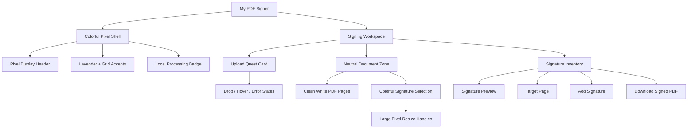

# Pixel Art Colorful Redesign

## Objective

Redesign My PDF Signer with a colorful pixel-art visual language while preserving document readability, privacy, accessibility, and the existing signing workflow.

The pixel-art treatment should be applied to the application chrome, panels, controls, and interaction states—not to the PDF itself.

## Design Principle

> Keep the application playful; keep the document workspace neutral.

Applying textures, filters, or excessive color around the rendered PDF would distract from the document and make signature placement harder. The PDF pages must remain white, clean, and visually dominant.

## Current Visual Architecture

- `src/App.tsx` owns the application shell, responsive workspace, state, desktop layout, and mobile signature dialog.
- `src/components/PdfUploader/PdfUploader.tsx` provides the PDF upload drop zone and its drag, keyboard, and error states.
- `src/components/PdfViewer/PdfViewer.tsx` renders vertically stacked PDF pages and signature overlays.
- `src/components/SignatureManager/SignatureManager.tsx` provides signature upload, preview, page selection, placement, and export controls.
- `src/components/SignatureOverlay/SignatureOverlay.tsx` handles signature selection, movement, resizing, and removal.
- Styling uses inline Tailwind CSS utilities. No new component hierarchy or styling dependency is required.

## Proposed Visual Concept

## Visual System

### Color Palette

| Token | Value | Usage |
|---|---:|---|
| Ink | `#241B35` | Borders and primary text |
| Paper | `#FFFDF5` | Cards and control surfaces |
| Lavender | `#E9E2FF` | Application background |
| Cyan | `#36C5F0` | Upload and secondary actions |
| Yellow | `#FFD84D` | Highlights and attention states |
| Coral | `#FF6B6B` | Errors and destructive actions |
| Green | `#39B86B` | Export and success actions |

### Geometry

- Use `2px` dark borders.
- Use hard `4px 4px 0` offset shadows.
- Keep corner radii between `0–4px`.
- Use a `4px/8px` spacing rhythm.
- Use block or checker accents sparingly.
- Avoid generic heavily rounded SaaS styling.

### Typography

- Use a pixel/display style only for large headings.
- Keep controls, filenames, page labels, status messages, and errors in a readable system sans-serif or monospace font.
- Do not load remote fonts because the application requires zero external requests.
- A locally bundled font is acceptable only if its asset is intentionally added to the project.

### Interaction States

Every interactive state should use more than color alone:

- Default
- Hover
- Active/pressed
- Keyboard focus
- Drag-over
- Selected
- Disabled
- Loading
- Error
- Success

Use border, icon, text, position, or shadow changes alongside color. Keyboard focus should have a high-contrast ring, and primary interactive targets should be at least `44px` where practical.

## Component Direction

### Application Shell

Turn the current neutral application shell into a lavender pixel-style environment with restrained decorative grid or block accents. Keep the privacy notice highly visible and style it as a compact status badge.

### PDF Uploader

Present the uploader as an upload or quest card:

- Hard border and offset shadow
- Clear drag-over movement or shadow state
- Distinct keyboard focus
- Coral error state with readable text
- No ambiguous icon-only actions

### Signature Manager

Treat the desktop sidebar and mobile dialog as a signature inventory:

- Signature preview as the current inventory item
- Page selection as a compact numeric control
- Add Signature as the primary placement action
- Download Signed PDF as a visually distinct green success action
- Replace and Remove remain clearly differentiated

### PDF Viewer

The document region must remain neutral:

- Neutral gray or soft paper-colored mat
- White PDF pages
- Restrained page shadows
- No checker texture behind page content
- No filters or `image-rendering: pixelated`
- Vivid colors reserved for selected signature outlines and handles

### Signature Overlay

Use colorful, high-contrast selection visuals while preserving accurate placement:

- Strong selection outline
- Larger resize handles
- Larger removal target
- Clear selected and unselected states
- Avoid visual effects that obscure signature edges

## Accessibility Findings

The redesign should address these existing weaknesses:

1. Signature movement and resizing are pointer-only.
2. Resize handles are approximately `12px` and too small for touch interaction.
3. The remove control is approximately `20px` and also too small.
4. The mobile dialog has Escape handling but lacks initial focus, focus trapping, and focus restoration.
5. Error/status messages do not consistently use alert or live-region semantics.
6. Export progress is visual only.
7. Some controls lack explicit `focus-visible` styling.
8. Pixel fonts may reduce readability when used for body text or controls.

Accessibility changes that alter interaction behavior should be handled deliberately rather than hidden inside purely visual restyling.

## Risks and Constraints

### Document Readability

The PDF is the product's primary content. Decorative visual treatment must never overlap, filter, tint, or visually compete with the rendered pages.

### Privacy

The redesign must preserve all privacy requirements:

- No external font or asset requests
- No document or signature uploads
- No persistence of PDF or signature content
- Keep the notice: “Your document is processed locally and never uploaded.”

### Responsive Behavior

The current desktop sidebar and mobile dialog structure can remain. Styling must be tested at narrow widths so hard shadows and thick borders do not cause overflow.

### Scope Control

No new component hierarchy, state library, CSS framework, or animation dependency is needed. Tailwind utilities and minimal global theme definitions are sufficient.

## Likely Files Affected

1. `src/App.tsx`
2. `src/components/PdfUploader/PdfUploader.tsx`
3. `src/components/PdfViewer/PdfViewer.tsx`
4. `src/components/SignatureManager/SignatureManager.tsx`
5. `src/components/SignatureOverlay/SignatureOverlay.tsx`
6. Optionally `src/index.css` for theme tokens and a local/system font stack

## Implementation Phases

### Phase 1 — Visual Direction

- Define color and geometry tokens.
- Restyle the application background, header, and privacy badge.
- Restyle cards, borders, shadows, and primary buttons.
- Do not change interaction behavior.

This phase is the smallest useful implementation and should be reviewed before continuing.

### Phase 2 — Complete Component Skin

- Restyle PDF and signature upload states.
- Restyle signature manager and mobile dialog.
- Add coherent error, loading, selected, and disabled states.
- Confirm responsive layout remains stable.

### Phase 3 — Document Interaction

- Refine the neutral document mat and page presentation.
- Improve signature selection contrast.
- Increase resize and remove target sizes.
- Validate touch interaction on mobile.

### Phase 4 — Accessibility

- Add mobile dialog focus management.
- Add live semantics for errors and export status.
- Define keyboard-operable signature placement controls.
- Validate contrast, focus visibility, and responsive behavior.

## Recommended Starting Point

Implement Phase 1 only across the shell, uploader, and signature sidebar. This is enough to validate whether the visual direction fits the product before changing document interactions or accessibility behavior.

## Decision Required Before Implementation

Choose one direction:

1. **Soft pixel:** paper surfaces, lavender background, modest hard shadows, sparse decoration.
2. **Arcade pixel:** stronger color blocks, checker accents, pronounced button states, and more energetic contrast.

The recommended default is **soft pixel** because this is a document utility, not a game. It gives the project character without making the signing workspace noisy.

## Local Pixel Typography Plan

### Context

The redesigned interface has pixel-style colors, borders, and shadows, but its default system typography weakens the visual direction. Add a locally bundled Pixelify Sans display font to strengthen the pixel-art identity without reducing readability, introducing remote requests, or affecting PDF content.

### Implementation

1. **Bundle Pixelify Sans locally**
   - Add `src/assets/fonts/PixelifySans.woff2` from the official upstream release.
   - Add its OFL license and provenance as `src/assets/fonts/OFL.txt`.
   - Do not add a package, runtime font loader, or remote font request.

2. **Register one display-font utility**
   - Update `src/index.css` with a single `@font-face` using the local WOFF2 asset, its actual weight range, and `font-display: swap`.
   - Extend the existing Tailwind v4 `@theme` block with `--font-display`, falling back to the current system sans stack.
   - Keep the application root and body font unchanged.

3. **Apply the font selectively**
   - Update `src/App.tsx` to apply `font-display` only to the “My PDF Signer” application heading and mobile “Signature settings” dialog heading.
   - Update `src/components/PdfUploader/PdfUploader.tsx` to apply it only to the uploader hero prompt.
   - Preserve system sans for controls, instructions, privacy text, errors, filenames, page labels, statuses, the small Signature Manager heading, and rendered PDF content.
   - Reassess tight tracking or line height only if Pixelify Sans clips or wraps poorly.

### Verification

- Run `bun run build` and `bun run lint`.
- Confirm the production build emits the WOFF2 asset from the application's own origin.
- Reload with the Network panel cleared and verify there are no Google Fonts, CDN, or other remote requests.
- Confirm fallback text remains visible if the font request is blocked.
- Check approximately `320px` mobile width for clipping, overlap, horizontal overflow, and collision with the dialog close control.
- Confirm computed styles use Pixelify Sans only on the three intended display elements.
- Confirm PDF and signature workflows remain local and unaffected.

Skipped: global pixel typography, preload machinery, a font package, and a font-specific component. Add preload only if measurement shows visibly late font swapping.
